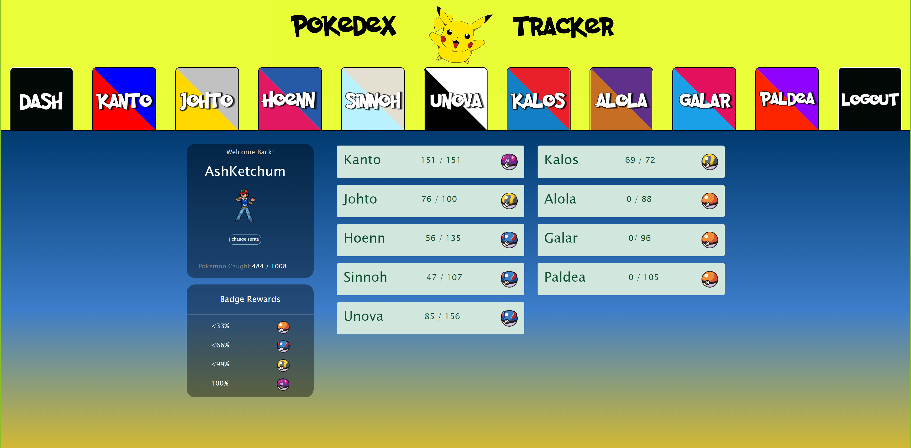

# Pokemon Tracker!

## A place for Pokemon trainers to keep track your overall pokedex progress, earn badges and customize your account!
This application serve as a tracker for Pokemon fans to keep track of all of the Pokemon that they've caught across all nine generations!  Once the user has signed up or logged in with valid credentials, they can choose an avatar for their account from over 1000 "sprite" images.  After that, they can begin logging Pokemon as "caught" within any of the nine pages representing each generation. As they catch more and more Pokemon, the badges on the dashboard will upgrade next to each box of data, containing their stats for each generation.  If the user catches all 1008 Pokemon, they will have the Master Ball badge next to all nine generations! Gotta catch 'em all!


[Come vist the Site!](https://pokemon-app.herokuapp.com/)



  ## Table of Contents
  * [Technologies Used](#technologies-used)
  * [Code Snippets](#code-snippets)<br />
  * [Contributors](#contributors)<br />
​
  ## Overview of the application

​
  ## Technologies Used
  ### Front end
  - React.js
  - JavaScript
  - Web APIs
  - Fetch
  - CSS
  - Bootstrap Framework
  - Session Storage
  ### Back End
  - JWT
  - Node
  - NPM
  - Express
  - GraphQL
  - Apollo
  - Mongoose
  - User Authentication
  - Bcrypt
  - Nodemon
​
  ## Code Snippets
Here is a function to determine which Pokeball badge gets rendered in front of a user's scores.  We decided there should be a badge for 0%-33% Pokemon caught, 33%-66%, 66%-99% and 100%.  The Pokeball badge images are stored in the variables that are returned
```javascript
function determineBadge (userTotal, genTotal){
  if(userTotal/genTotal < .33){ 
    return pokeball
  }else if (userTotal/genTotal < .66){
    return greatball
  }else if (userTotal/genTotal <.9999){
    return ultraball
  }else if (userTotal/genTotal == 1){
    return masterball
  }}
  
```
...and here is the function being called within an image tag, being given the appropriate arguments
```javascript
</img>
```
Here is the functionality for logging in a user.  It utilizes the "useState" and "useMutation" methods.  It starts the login form off with empty text
```javascript
const Login = (props) => {
  const [formState, setFormState] = useState({
    email: "",
    password: "",
  });
  const [loginUser, { error, data }] = useMutation(LOGIN_USER);

  const handleChange = (event) => {
    const { name, value } = event.target;
    setFormState({ ...formState, [name]: value });
  };

  const handleFormSubmit = async (event) => {
    event.preventDefault();
    try {
      const { data } = await loginUser({ variables: { ...formState } });
      localStorage.setItem('username', data.loginUser.user.username)
      Auth.login(data.loginUser.token);
    } catch (e) {
      console.log(e);
    }

    setFormState({
      username: "",
      email: "",
      password: "",
    });
  };
```
```javascript

```
    
    
  ## Contributors
If you have any questions about this project, feel free to reach out to one of us at:
* Matt Gatsby :
    * [Github](https://github.com/mattjgatsby)
    * [LinkedIn](https://www.linkedin.com/in/matthew-gatsby-1a1521250/)
* Anthony Manzione:
     * [Github](https://github.com/AJManzione)
     * [LinkedIn](https://www.linkedin.com/in/dev-anthony-manzione/)
* Michael Seaman :
    * [Github](https://github.com/mseaman26)
    * [LinkedIn](https://www.linkedin.com/in/michael-seaman-120a59250/)
* Senay Gebrat :
    * [Github](https://github.com/senaygebrat)
    * [LinkedIn](https://www.linkedin.com/in/senayg/)